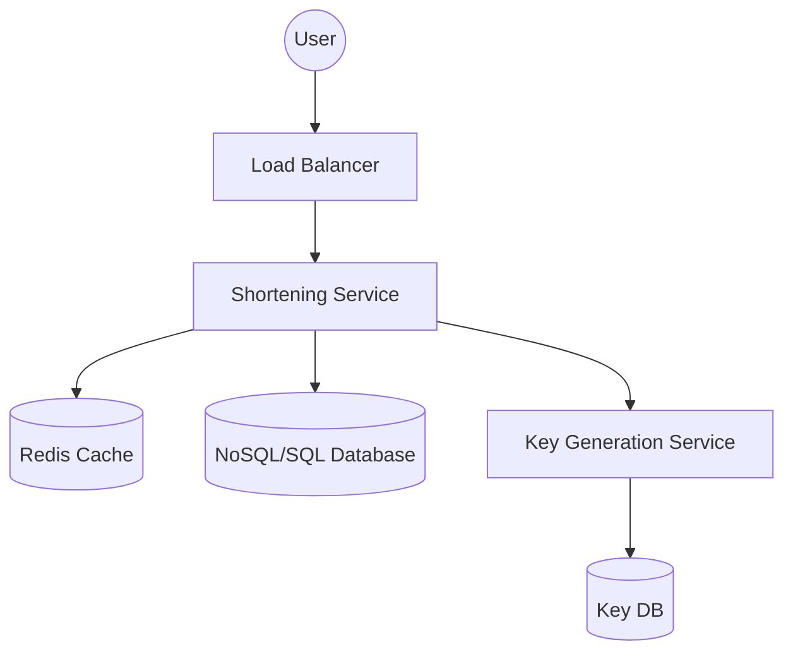

# High-Level Design: URL Shortener (TinyURL)
**Target Companies**: Google, Microsoft, Amazon

## 📝 Problem Statement
Humein ek system design karna hai jo lambe URLs ko chote (short) URLs mein convert kare, aur jab koi short URL click kare toh use original URL pe redirect kare.

## 🏗️ Architecture Diagram

## 🧠 Hinglish Explanation (Logic)

1. **API Endpoints**:
   - `postShorten(longURL)`: Naya short URL banane ke liye.
   - `getOriginal(shortURL)`: Redirect karne ke liye (301 Permanent Redirect best hai SEO ke liye).

2. **How to generate Short Key?**:
   - Hum **Base62 encoding** use karte hain (a-z, A-Z, 0-9).
   - Agar 7 characters ki key banayein, toh $62^7 \approx 3.5$ trillion unique URLs ban sakte hain!
   - **KGS (Key Generation Service)**: Ek separate service jo pehle se unique keys bana ke rakhti hai taaki runtime pe collision na ho.

3. **Storage (Database)**:
   - Humein millions of records store karne hain. **NoSQL (like Cassandra or MongoDB)** best hai kyunki humein complex joins nahi chahiye, bas `shortURL -> longURL` mapping chahiye.
   - **Read vs Write**: Ye system **heavy-read** hai. Log redirect zyada karte hain shorten kam. Isliye **Redis caching** bahut important hai popular URLs ke liye.

4. **Scalability**:
   - Multiple application servers handle karenge load.
   - Database sharding (partitioning) use karenge based on the short key.

## 🚀 Interview Tips:
- Hamesha **Back-of-the-envelope estimation** se start karein (Storage, Bandwidth).
- 301 Redirect vs 302 Redirect ka difference batayein.
