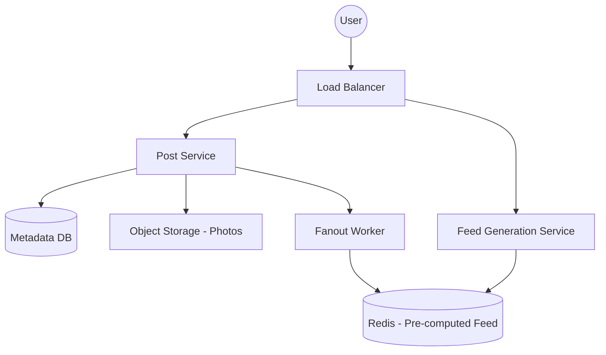

# High-Level Design: Instagram News Feed 📸
**Target Companies**: Meta, Google, Amazon

## 📝 Problem Statement
Humein ek aisa system design karna hai jahan users photos post kar sakein aur unke followers ko 'News Feed' dikhe (unke doston ki latest posts).

## 🏗️ Architecture Diagram

## 🧠 Hinglish Explanation (Logic)

1. **Post Storage**:
   - Photos/Videos ko **S3** ya kisi Object Storage mein rakhte hain (Database mein sirf path/URL save karte hain).
   - Metadata (user info, post time, etc.) **Postgres/MySQL** ya **Cassandra** mein jata hai.

2. **News Feed Generation**:
   - **Pull Model (Fan-out at Load)**: Jab user app kholta hai tab feed generate hoti hai. (Easy for celebs, but slow for users).
   - **Push Model (Fan-out at Write)**: Jab koi post karta hai, toh uske saare followers ke cache mein wo post push ho jati hai. (Fast for users, but celeb post pe system crash ho sakta hai - *Celebrity Problem*).
   - **Hybrid Model**: Normal users ke liye Push, aur celebs ke liye Pull.

3. **Ranking Algorithm**:
   - Feed sirf chronological nahi hoti. Engagement (likes, comments) ke basis pe rank hoti hai. Data Science model scoring karta hai.

4. **Scalability**:
   - **CDN (Content Delivery Network)**: Photos ko user ke nazdik dikhaane ke liye.
   - **Caching**: Users ki profile aur recent posts Redis mein.

## 🚀 Interview Tips:
- **Consistency vs Availability**: Instagram redundant data dikha sakta hai (Availability high chahiye) but post turant dikhni chahiye.
- **Pagination**: Ek baar mein 20-30 posts hi load karein (Infinite scrolling).
