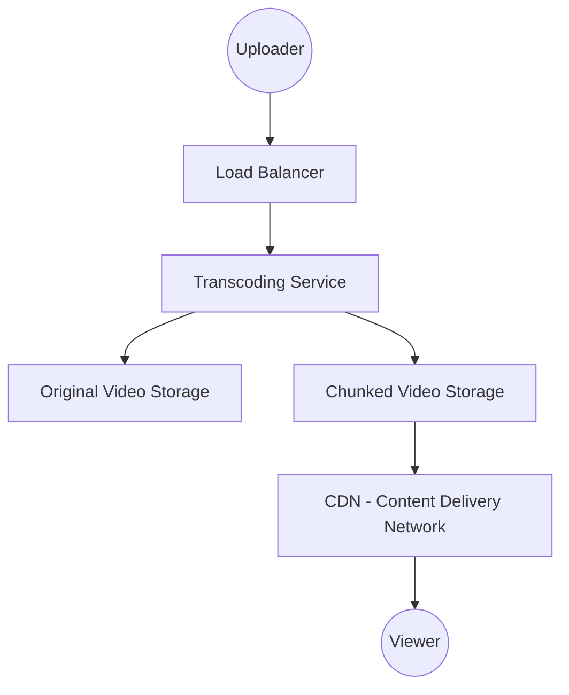

# High-Level Design: Netflix/YouTube (Video Streaming) 🍿
**Target Companies**: Google (YouTube), Netflix, Amazon (Prime)

## 📝 Problem Statement
Video upload karne ka aur millions of users ko low latency ke saath stream karne ka system design karna.

## 🏗️ Architecture Diagram

## 🧠 Hinglish Explanation (Logic)

1. **Transcoding (Conversion)**:
   - Sabse important! Ek video ko different formats (.mp4, .mkv) aur resolutions (1080p, 720p, 360p) mein convert karna padta hai taaki low bandwidth users bhi dekh sakein.
   - Video ko **chunks** (chhote pieces, 2-5 sec) mein toda jata hai.

2. **Adaptive Bitrate Streaming (ABR)**:
   - Jaise-jaise internet speed change hoti hai, player apne aap quality change karta hai (Netflix pe dhoondhla hota hai par chalta rehta hai). HLS (Apple) ya DASH protocols use hote hain.

3. **CDN (The Real Hero)**:
   - Poori duniya mein servers hote hain. Video file origin server se nahi, baki aapke shehar ke nazdik waale server se aati hai.

4. **Search & Recommendations**:
   - **Elasticsearch** fast searches ke liye.
   - **Machine Learning (Big Data)** background mein kaam karta hai user behavior ke basis pe suggest karne ke liye.

## 🚀 Interview Tips:
- **Write-heavy vs Read-heavy**: Uploads are write-heavy (queueing important), Streaming is extremely read-heavy.
- **Microservices**: Auth, Billing, Recommendations, Streaming sab alag services honi chahiye.
