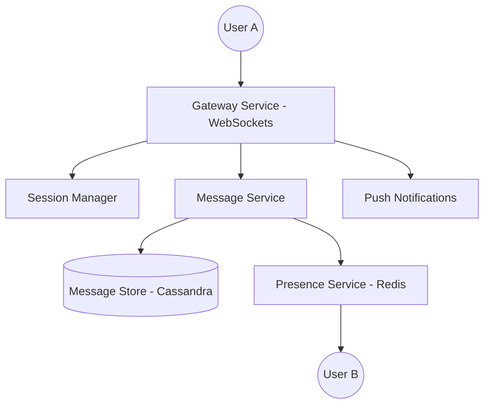

# High-Level Design: WhatsApp (Real-time Messaging) 💬
**Target Companies**: Meta, Microsoft, Amazon

## 📝 Problem Statement
One-to-one messaging, group chats, aur last seen/online status ka system design karna jo billions of messages handle kar sake.

## 🏗️ Architecture Diagram

## 🧠 Hinglish Explanation (Logic)

1. **Protocol (WebSockets)**:
   - HTTP use nahi kar sakte kyunki wo client-request based hai. Humein "Real-time" chahiye, isliye **WebSockets** use hote hain (Bi-directional connection).

2. **Message Storage**:
   - Messages ephemeral (kuch der ke liye) bhi ho sakte hain aur permanent bhi. **Cassandra** best hai kyunki ye write-heavy workloads ke liye design kiya gaya hai aur scalable hai.
   - **Sequence Number**: Messages ka order maintain karna bahut zaruri hai (Clock skew solution).

3. **Last Seen / Presence**:
   - Har 30-60 sec mein app 'Heartbeat' bhejta hai. Status **Redis** mein store hota hai (Key: UserID, Value: Timestamp).

4. **Group Conversations**:
   - Jab koi message group mein bhejta hai, toh system use saare participants ke unique queues mein push karta hai.

## 🚀 Interview Tips:
- **End-to-End Encryption (E2EE)**: Batayein ki message server pe encrypted data ki tarah save hota hai.
- **Message Acknowledgment**: Sent (one tick), Delivered (two ticks), Read (blue ticks) ka logic.
