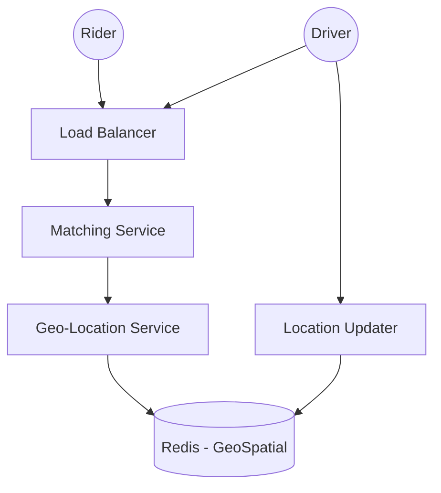

# High-Level Design: Uber (Ride Sharing) 🚗
**Target Companies**: Uber (obv), Amazon, Grab, Ola

## 📝 Problem Statement
Riders ko drivers se connect karna based on location, aur real-time tracking provide karna.

## 🏗️ Architecture Diagram

## 🧠 Hinglish Explanation (Logic)

1. **Geo-Spatial Indexing (QuadTrees / GeoHash)**:
   - Sabse bada challenge! Earth ko zones mein divide karna padta hai. **GeoHash** ya **Google S2 Library** use hoti hai location ko represent karne ke liye.
   - Drivers hamesha apna location update bhejte rehte hain (every 3-5 sec).

2. **Matching Algorithm**:
   - Jab Rider request karta hai, toh Query chalti hai: "Find top 10 available drivers in this 2km GeoHash/Grid".

3. **Pricing (Dynamic/Surge)**:
   - Supply (drivers) aur Demand (riders) ke basis pe price calculate hota hai using ML models.

4. **Storage**:
   - Trip History ke liye **Cassandra** (Write-heavy).
   - Real-time location ke liye **Redis (Geo Features)**.

## 🚀 Interview Tips:
- **Google Maps Interaction**: Map renders aur route calculation ke liye external APIs.
- **WebSocket connection**: Driver aur Rider ke beech real-time position sync karne ke liye.
